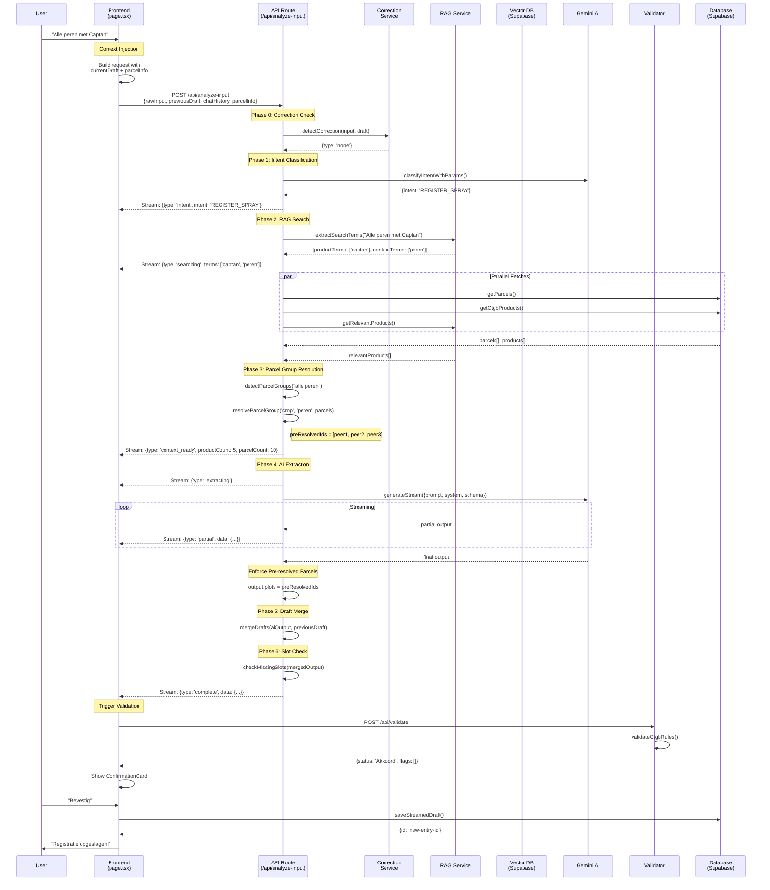

# AgriBot Slimme Invoer - Technische Deep Dive

> **Versie:** 3.1.5
> **Laatst bijgewerkt:** Januari 2026
> **Status:** Production-ready met Supabase backend

Dit document beschrijft de volledige data flow van de AgriBot "Slimme Invoer" feature, van gebruikersinvoer tot database-actie.

---

## Inhoudsopgave

1. [Architectuur Overzicht](#1-architectuur-overzicht)
2. [Frontend Layer](#2-frontend-layer)
3. [API & Orchestration](#3-api--orchestration)
4. [The AI Brain](#4-the-ai-brain)
5. [Knowledge Layer (RAG)](#5-knowledge-layer-rag--semantic-search)
6. [Validation & Safety](#6-validation--safety)
7. [Sequence Diagram](#7-sequence-diagram)
8. [Key Data Structures](#8-key-data-structures)

---

## 1. Architectuur Overzicht

```
┌─────────────────────────────────────────────────────────────────────────┐
│                          USER INPUT                                      │
│                   "Alle peren gespoten met Captan"                       │
└─────────────────────────────────────────────────────────────────────────┘
                                    │
                                    ▼
┌─────────────────────────────────────────────────────────────────────────┐
│  FRONTEND (page.tsx)                                                     │
│  ├─ Context Injection: Stuurt currentDraft + parcelInfo mee             │
│  ├─ Chat History: Laatste 10 berichten voor conversatie-context         │
│  └─ Streaming: Real-time feedback via NDJSON stream                     │
└─────────────────────────────────────────────────────────────────────────┘
                                    │
                                    ▼
┌─────────────────────────────────────────────────────────────────────────┐
│  API ROUTE (/api/analyze-input)                                          │
│  ├─ Phase 0: Correction Detection (instant, no AI)                      │
│  ├─ Phase 1: Intent Classification (Gemini Flash)                       │
│  ├─ Phase 2: RAG - Product Search (Keyword + Semantic)                  │
│  ├─ Phase 3: Parcel Group Resolution ("alle peren" → IDs)               │
│  ├─ Phase 4: AI Intent Extraction (Gemini + context)                    │
│  ├─ Phase 5: Draft Merge (add/remove/update existing draft)             │
│  └─ Phase 6: Slot Filling Check (missing required data?)                │
└─────────────────────────────────────────────────────────────────────────┘
                                    │
                                    ▼
┌─────────────────────────────────────────────────────────────────────────┐
│  VALIDATION (/api/validate + ctgb-validator.ts)                          │
│  ├─ Product Name Normalization                                          │
│  ├─ Crop Permission Check                                               │
│  ├─ Dosage Limit Validation                                             │
│  ├─ Interval Check (tijd tussen toepassingen)                           │
│  └─ Season Max Check (max toepassingen per teelt)                       │
└─────────────────────────────────────────────────────────────────────────┘
                                    │
                                    ▼
┌─────────────────────────────────────────────────────────────────────────┐
│  DATABASE (Supabase)                                                     │
│  ├─ logbook_entries: Draft opgeslagen                                   │
│  ├─ spuitschrift_entries: Na bevestiging                                │
│  └─ parcel_history_entries: Per-perceel historie                        │
└─────────────────────────────────────────────────────────────────────────┘
```

---

## 2. Frontend Layer

**Bestand:** `src/app/(app)/page.tsx`

### 2.1 Input Verzenden

De frontend stuurt de gebruikersinvoer naar de API via een POST request met streaming response:

```typescript
const response = await fetch('/api/analyze-input', {
    method: 'POST',
    headers: { 'Content-Type': 'application/json' },
    body: JSON.stringify({
        rawInput: inputText,           // "Busje niet"
        previousDraft: currentDraft,   // De huidige draft (Context Injection)
        chatHistory: recentHistory,    // Laatste 10 berichten
        parcelInfo: parcelInfoForCorrection  // Perceel metadata
    }),
    signal: abortControllerRef.current.signal
});
```

### 2.2 Context Injection

**Probleem:** Als een gebruiker zegt "Busje niet", moet de AI weten welke percelen er in de draft staan om "Busje" te kunnen verwijderen.

**Oplossing:** We sturen de **huidige draft state** mee met elk verzoek:

```typescript
// CRITICAL: Bij corrections gebruiken we confirmationData, niet activeDraft
const currentDraft = (draftStatus === 'confirming' || draftStatus === 'editing') && confirmationData
    ? {
        id: activeDraft?.id || 'temp-draft',
        plots: confirmationData.plots,      // ["busje-id", "jachthoek-id", ...]
        products: confirmationData.products,
        date: confirmationData.date
    }
    : activeDraft;
```

**Waarom `confirmationData`?**
- Bij sequentiële correcties ("Busje niet" → "Jachthoek ook niet") moet elke correctie werken op het **resultaat van de vorige correctie**
- `activeDraft` wordt pas bijgewerkt na database save
- `confirmationData` bevat de real-time state na elke wijziging

### 2.3 Parcel Info voor Name Resolution

```typescript
const parcelInfoForCorrection = allParcels.map(p => ({
    id: p.id,
    name: p.name,      // "Busje"
    variety: p.variety, // "Elstar"
    crop: p.crop       // "Appel"
}));
```

Dit maakt het mogelijk om "Busje niet" te matchen met de juiste perceel-ID.

### 2.4 Streaming Response Handling

De API stuurt NDJSON (newline-delimited JSON) terug:

```typescript
while (true) {
    const { done, value } = await reader.read();
    if (done) break;

    const lines = decoder.decode(value).split('\n').filter(Boolean);
    for (const line of lines) {
        const message: StreamMessage = JSON.parse(line);

        switch (message.type) {
            case 'searching':    // RAG zoekt producten
            case 'context_ready': // Context geladen
            case 'extracting':   // AI verwerkt
            case 'partial':      // Tussentijds resultaat
            case 'complete':     // Volledig resultaat
            case 'correction':   // Correctie toegepast (instant)
            case 'slot_request': // Ontbrekende info nodig
            case 'error':        // Fout
        }
    }
}
```

---

## 3. API & Orchestration

**Bestand:** `src/app/api/analyze-input/route.ts`

### 3.1 Request Validatie

```typescript
const AnalyzeInputRequestSchema = zod.object({
    rawInput: zod.string().min(1),
    previousDraft: zod.object({
        plots: zod.array(zod.string()),
        products: zod.array(ProductSchema),
        date: zod.string().optional(),
    }).optional(),
    chatHistory: zod.array(ChatMessageSchema).optional(),
    parcelInfo: zod.array(ParcelInfoSchema).optional(),
});
```

### 3.2 Phase 0: Correction Detection (Instant)

**Geen AI nodig!** Pattern matching voor snelle correcties:

```typescript
const correction = detectCorrection(rawInput, draftContext);

if (correction.type !== 'none' && correction.confidence >= 0.7) {
    // Direct toepassen zonder AI roundtrip
    const updatedDraft = applyCorrection(correction, draftContext);
    send({ type: 'correction', correction, updatedDraft });
    return;
}
```

**Ondersteunde correctie types:**
| Type | Voorbeeld | Actie |
|------|-----------|-------|
| `remove_specific_plot` | "Busje niet" | Verwijder perceel "Busje" |
| `remove_last_plot` | "Niet dat perceel" | Verwijder laatste perceel |
| `update_dosage` | "Nee, 1.5 kg" | Update dosering |
| `undo` | "Ongedaan maken" | Herstel vorige state |
| `cancel_all` | "Stop" | Wis alles |

### 3.3 Phase 1: Intent Classification

```typescript
const intentResult = await classifyIntentWithParams({
    userInput: rawInput,
    hasDraft: hasDraft,
});
```

**Intent Types:**
- `REGISTER_SPRAY` - Nieuwe bespuiting registreren
- `MODIFY_DRAFT` - Bestaande draft wijzigen
- `QUERY_PRODUCT` - Product informatie opvragen
- `QUERY_HISTORY` - Spuitgeschiedenis opvragen
- `QUERY_REGULATION` - Regelgeving opvragen
- `CONFIRM` / `CANCEL` - Bevestig of annuleer

### 3.4 Phase 2-3: Parcel Group Resolution

```typescript
// Detecteer groeps-keywords
const { hasGroupKeyword, groupType, groupValue } = detectParcelGroups(rawInput);
// "alle peren" → { hasGroupKeyword: true, groupType: 'crop', groupValue: 'peren' }

// Resolve naar specifieke percelen
if (hasGroupKeyword && groupType && groupValue) {
    const matchedParcels = resolveParcelGroup(groupType, groupValue, allParcels);
    preResolvedParcelIds = matchedParcels.map(p => p.id);
}
```

**Crop Detection:**
1. Check `parcel.crop` veld
2. Fallback naar `parcel.subParcels[0].crop`
3. Laatste fallback: extract uit perceel naam ("Peer Noord" → crop = "peer")

### 3.5 Phase 4: AI Intent Extraction

De AI krijgt een uitgebreide system prompt met:

```typescript
const systemPrompt = `
=== MULTI-TURN CONVERSATIE REGELS ===
${hasDraft ? `
**ER IS EEN ACTIEVE DRAFT** - Bepaal eerst of de gebruiker:
1. CORRECTIE/VERWIJDERING maakt (action: "remove")
2. TOEVOEGING maakt (action: "add")
3. UPDATE/WIJZIGING maakt (action: "update")
4. NIEUWE registratie start (action: "new")

HUIDIGE DRAFT:
- Percelen: ${previousDraft.plots.map(id => `${parcelInfo.name} (ID: ${id})`).join(', ')}
- Middelen: ${previousDraft.products.map(p => `${p.product} (${p.dosage} ${p.unit})`).join(', ')}

⚠️ KRITIEK: REFINEMENT PROTOCOL
Bij ELKE actie behalve "new", werk ALLEEN met huidige draft percelen!
❌ VERBODEN: Alle percelen uit database halen bij remove/update
✅ CORRECT: Alleen de genoemde items verwijderen/toevoegen
` : 'Geen actieve draft - dit is een NIEUWE registratie'}

=== BESCHIKBARE PRODUCTEN ===
${productContext}

=== BESCHIKBARE PERCELEN ===
${JSON.stringify(parcelList)}

${preResolvedParcelIds ? `
BELANGRIJK: De gebruiker zei "${groupValue}" - dit zijn de perceel IDs:
${JSON.stringify(preResolvedParcelIds)}
` : ''}
`;
```

### 3.6 Phase 5: Draft Merge

```typescript
function mergeDrafts(aiOutput, previousDraft) {
    switch (aiOutput.action) {
        case 'add':
            // Voeg toe aan bestaande draft
            result.plots = [...new Set([...previousDraft.plots, ...aiOutput.plots])];
            break;

        case 'remove':
            // Verwijder uit bestaande draft
            result.plots = previousDraft.plots.filter(p => !plotsToRemove.has(p));
            break;

        case 'update':
            // Update specifieke velden
            result.plots = aiOutput.plots.length > 0 ? aiOutput.plots : previousDraft.plots;
            break;

        case 'new':
            // Vervang volledig
            return aiOutput;
    }
}
```

### 3.7 Pre-Resolved Parcel Enforcement

**Kritieke stap:** De AI kan soms alle percelen teruggeven i.p.v. alleen de gefilterde. We forceren de pre-resolved IDs:

```typescript
// ALWAYS use pre-resolved parcels for group keywords
if (lastOutput && preResolvedParcelIds && lastOutput.action === 'new' && hasGroupKeyword) {
    console.log(`Enforcing pre-resolved parcels for "${groupValue}"`);
    lastOutput.plots = preResolvedParcelIds;  // Override AI output
}
```

---

## 4. The AI Brain

### 4.1 AI Providers

- **Intent Classification:** Gemini Flash (snel, goedkoop)
- **Intent Extraction:** Gemini Pro via Genkit (streaming)
- **Embeddings:** Google `text-embedding-004` (768 dimensies)

### 4.2 Output Schema

```typescript
const IntentSchema = z.object({
    action: z.enum(['new', 'add', 'remove', 'update']),
    plots: z.array(z.string()),
    plotsToRemove: z.array(z.string()).optional(),
    products: z.array(z.object({
        product: z.string(),
        dosage: z.number(),
        unit: z.string(),
        targetReason: z.string().optional()
    })),
    productsToRemove: z.array(z.string()).optional(),
    date: z.string().optional(),
});
```

### 4.3 Streaming Output

```typescript
const { stream: aiStream } = ai.generateStream({
    prompt: userPrompt,
    system: systemPrompt,
    output: { schema: IntentSchema },
});

for await (const chunk of aiStream) {
    if (chunk.output?.plots && chunk.output?.products) {
        send({ type: 'partial', data: chunk.output });
    }
}
```

---

## 5. Knowledge Layer (RAG & Semantic Search)

**Bestanden:** `src/lib/rag-service.ts`, `src/lib/embedding-service.ts`

### 5.1 Twee Search Methodes

| Methode | Wanneer | Hoe |
|---------|---------|-----|
| **Keyword Search** | Product naam bekend | `searchCtgbProducts("Captan")` |
| **Semantic Search** | Vraag over regelgeving | Vector similarity in Supabase |

### 5.2 Semantic Search Flow

```
User Query: "Middel tegen schurft op peer"
        │
        ▼
┌───────────────────────────────────────┐
│  1. generateEmbedding(query)          │
│     Model: text-embedding-004         │
│     Output: [0.023, -0.15, ...] (768) │
└───────────────────────────────────────┘
        │
        ▼
┌───────────────────────────────────────┐
│  2. Supabase RPC: match_product_usages│
│     - Vector similarity search        │
│     - Threshold: 0.35 (cosine)        │
│     - Limit: 10 results               │
└───────────────────────────────────────┘
        │
        ▼
┌───────────────────────────────────────┐
│  3. Return ProductUsageMatch[]        │
│     - productNaam: "Captan 80 WDG"    │
│     - gewas: "Peer"                   │
│     - doelorganisme: "Schurft"        │
│     - dosering: "1.5 kg/ha"           │
│     - similarity: 0.87                │
└───────────────────────────────────────┘
```

### 5.3 Embedding Generation

```typescript
// src/lib/embedding-service.ts
export async function generateEmbedding(text: string): Promise<number[]> {
    const response = await ai.embed({
        embedder: 'googleai/text-embedding-004',
        content: text,
    });
    return response[0].embedding;  // 768-dimensional vector
}
```

### 5.4 Vector Search RPC

```sql
-- Supabase function: match_product_usages
CREATE FUNCTION match_product_usages(
    query_embedding vector(768),
    match_threshold float,
    match_count int
) RETURNS TABLE (...) AS $$
    SELECT
        id, product_naam, gewas, doelorganisme, dosering,
        1 - (embedding <=> query_embedding) AS similarity
    FROM product_usages
    WHERE 1 - (embedding <=> query_embedding) > match_threshold
    ORDER BY similarity DESC
    LIMIT match_count;
$$ LANGUAGE sql;
```

### 5.5 Context Building

```typescript
function buildProductUsageContext(matches: ProductUsageMatch[]): string {
    // Group by product for cleaner output
    const byProduct = new Map<string, ProductUsageMatch[]>();

    // Format for AI prompt
    return `
PRODUCT: Captan 80 WDG (12345)
  Gewas: Peer
  Doelorganisme: Schurft (Venturia pirina)
  Dosering: 1.5 kg/ha
  Veiligheidstermijn: 21 dagen
  Max toepassingen: 4
---
PRODUCT: Delan WG (67890)
  ...
`;
}
```

---

## 6. Validation & Safety

**Bestand:** `src/lib/ctgb-validator.ts`

### 6.1 Defensive Coding Principes

1. **Geen AI voor validatie** - Pure TypeScript logica
2. **Geen crashes** - Graceful degradation met warnings
3. **Consistente resultaten** - Deterministische checks

### 6.2 Validation Flow

```typescript
async function validateCtgbRules(input: ValidationInput): Promise<CtgbValidationResult> {
    // 1. Match plot identifiers to actual parcels
    const selectedParcels = matchParcels(input.draft.plots, input.parcels);

    // 2. For each product in draft
    for (const productEntry of input.draft.products) {
        // 2a. Find and normalize product name
        const ctgbProduct = findCtgbProduct(productEntry.product, productMap);

        // 2b. Validate on each selected parcel
        for (const parcel of selectedParcels) {
            const result = await validateSprayApplication(
                parcel,
                ctgbProduct,
                productEntry.dosage,
                productEntry.unit,
                applicationDate,
                parcelHistory,  // For interval checks
                ctgbProducts,
                expectedHarvestDate,
                productEntry.targetReason
            );

            // Collect flags
            flags.push(...result.flags);
        }
    }

    // 3. Determine final status
    return {
        isValid: errorCount === 0,
        status: errorCount > 0 ? 'Afgekeurd'
              : warningCount > 0 ? 'Waarschuwing'
              : 'Akkoord',
        flags,
        normalizedProducts
    };
}
```

### 6.3 Validation Checks

| Check | Type | Voorbeeld |
|-------|------|-----------|
| Product niet gevonden | Warning | "XYZ niet in CTGB database" |
| Gewas niet toegelaten | Error | "Captan niet toegelaten voor aardbeien" |
| Dosering te hoog | Warning | "2.5 kg/ha overschrijdt max 2 kg/ha" |
| Interval te kort | Error | "Minimaal 7 dagen tussen toepassingen" |
| VGT niet gehaald | Error | "21 dagen VGT, oogst over 14 dagen" |
| Max toepassingen bereikt | Error | "Max 4x per seizoen, dit is toepassing 5" |

### 6.4 Fuzzy Product Matching

```typescript
function findCtgbProduct(searchName: string, productMap: Map<string, CtgbProduct>) {
    // 1. Exact match
    if (productMap.has(searchName.toLowerCase())) {
        return productMap.get(searchName.toLowerCase());
    }

    // 2. Starts-with match
    for (const [key, product] of productMap) {
        if (key.startsWith(searchName.toLowerCase())) {
            return product;
        }
    }

    // 3. Contains match
    for (const [key, product] of productMap) {
        if (key.includes(searchName.toLowerCase())) {
            return product;
        }
    }

    // 4. First-word match ("Captan" → "Captan 80 WDG")
    const firstWord = searchName.split(/[\s-]/)[0];
    for (const [key, product] of productMap) {
        if (key.split(/[\s-]/)[0] === firstWord) {
            return product;
        }
    }

    return null;
}
```

---

## 7. Sequence Diagram



---

## 8. Key Data Structures

### 8.1 DraftContext (Correction Service)

```typescript
interface DraftContext {
    plots: string[];              // Perceel IDs
    parcelInfo?: ParcelInfo[];    // Metadata voor name resolution
    products: Array<{
        product: string;
        dosage: number;
        unit: string;
    }>;
    date?: string;
}
```

### 8.2 ConfirmationData (Frontend)

```typescript
interface ConfirmationData {
    plots: string[];
    products: Array<{
        product: string;
        dosage: number;
        unit: string;
        targetReason?: string;
    }>;
    date?: string;
    validationResult?: ValidationResult;
    wasMerged: boolean;           // Was dit een merge met bestaande draft?
    existingDraftId?: string;     // ID van bestaande entry (voor updates)
}
```

### 8.3 StreamMessage Types

```typescript
type StreamMessage =
    | { type: 'intent'; intent: string; confidence: number }
    | { type: 'searching'; terms: string[] }
    | { type: 'context_ready'; productCount: number; parcelCount: number }
    | { type: 'extracting' }
    | { type: 'partial'; data: Partial<IntentOutput> }
    | { type: 'complete'; data: IntentOutput; merged?: boolean }
    | { type: 'correction'; correction: CorrectionResult; updatedDraft: DraftContext }
    | { type: 'slot_request'; slotRequest: SlotRequest }
    | { type: 'error'; message: string };
```

### 8.4 ProductUsageMatch (RAG)

```typescript
interface ProductUsageMatch {
    id: string;
    productId: string;
    productNaam: string;
    toelatingsnummer: string;
    gewas: string | null;
    doelorganisme: string | null;
    dosering: string | null;
    veiligheidstermijn: string | null;
    maxToepassingen: number | null;
    interval: string | null;
    content: string;           // Full text for context
    similarity: number;        // 0-1 cosine similarity
}
```

---

## Appendix: File Reference

| Component | File | Purpose |
|-----------|------|---------|
| Frontend | `src/app/(app)/page.tsx` | Main UI, state management, streaming |
| API Route | `src/app/api/analyze-input/route.ts` | Orchestration, AI calls |
| Correction Service | `src/lib/correction-service.ts` | Pattern-based corrections |
| Parcel Resolver | `src/lib/parcel-resolver.ts` | "alle peren" → IDs |
| RAG Service | `src/lib/rag-service.ts` | Product search, context building |
| Embedding Service | `src/lib/embedding-service.ts` | Vector generation |
| CTGB Validator | `src/lib/ctgb-validator.ts` | Rule validation |
| Validation Service | `src/lib/validation-service.ts` | Detailed spray validation |
| Supabase Store | `src/lib/supabase-store.ts` | Database operations |

---

*Dit document is automatisch gegenereerd als referentie voor ontwikkelaars. Voor vragen of updates, neem contact op met het AgriBot team.*
